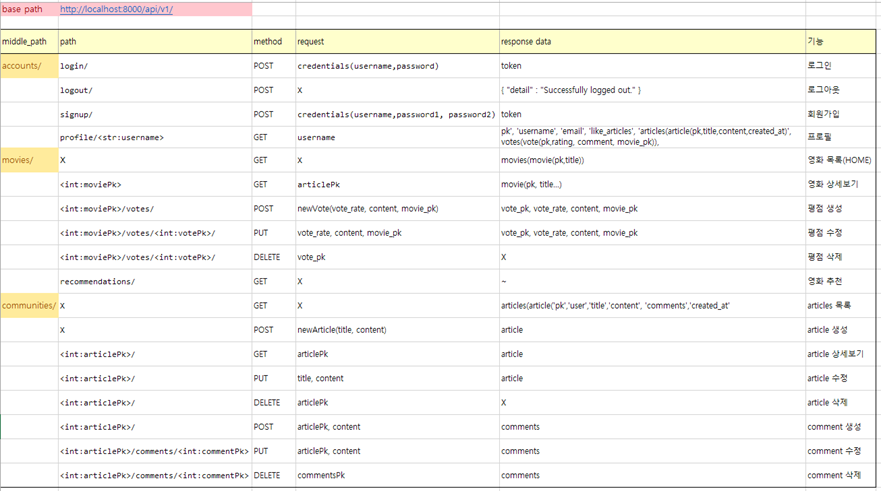
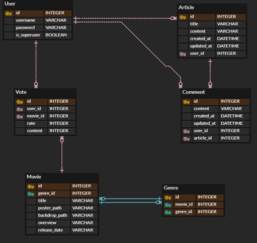
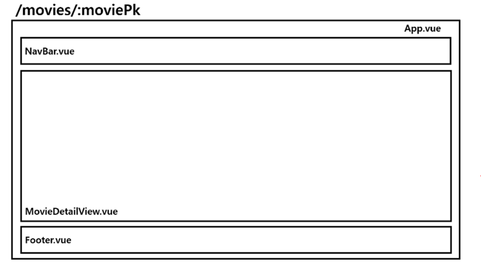

# 2022 1학기 영화추천 웹페이지 프로젝트

[TOC]

# 주제

**근본극장**

보통 영화를 추천받을 때 많은 사람들이 명작으로 평가하는, 소위 ‘근본’이 있는 영화들을 추천받고 싶음

운영자가 ‘근본’이 있는 영화들을 채워넣어서 제공할 수 있도록 하는 서비스 구상

유저의 근본력에 따라, 특히 부족한 근본력을 채워줄 수 있도록 영화를 추천하도록 함


# 역할분담

SSAFY 7기 서울 4반 1조 **TEAM BASIS**

박나경 : 프론트엔드 설계, 디자인

​			   Vue, Vuex, Bootstrap

이성진 : 백엔드 설계, 알고리즘

​			   Django, SQLite


# 환경설정

:ballot_box_with_check: **pip 설치**

기본 프로젝트 생성 후, 추가적으로 설치한 패키지는 다음과 같다

```text
pip install django==3.2.12
pip install djangorestframework
pip install django_extensions
pip install django_cors_headers
pip install django-allauth
pip install dj-rest-auth
```

가상환경 생성 후, `pip install -r requirements.txt` 명령어를 통해 필요한 패키지 설치


:ballot_box_with_check: **npm 설치**

기본 프로젝트 생성 후, 추가적으로 설치한 패키지는 다음과 같다

```text
npm install vue-cookies
npm install —save axios 
npm install @vuejs-community/vue-filter-date-format
```

`npm install` 명령어를 통해 package.json에서 필요한 패키지를 설치


# 프로젝트 구조

```text
+---final-pjt
|   0519_workshop.pptx
|   README.md
|   README.pdf
|   tree.txt
|   
+---final-pjt-back
|   |   .gitignore
|   |   db.sqlite3
|   |   genres.json
|   |   manage.py
|   |   movies.json
|   |   requirements.txt
|   |   
|   +---accounts
|   |   |   admin.py
|   |   |   apps.py
|   |   |   models.py
|   |   |   serializers.py
|   |   |   tests.py
|   |   |   urls.py
|   |   |   views.py
|   |   |   __init__.py
|   |   |   
|   |   +---migrations
|   |   |   |   0001_initial.py
|   |   |   |   __init__.py
|   |   |   |   
|   |           
|   +---communities
|   |   |   admin.py
|   |   |   apps.py
|   |   |   models.py
|   |   |   serializers.py
|   |   |   tests.py
|   |   |   urls.py
|   |   |   views.py
|   |   |   __init__.py
|   |   |   
|   |   +---migrations
|   |   |   |   0001_initial.py
|   |   |   |   __init__.py
|   |           
|   +---django_backend
|   |   |   asgi.py
|   |   |   settings.py
|   |   |   urls.py
|   |   |   wsgi.py
|   |   |   __init__.py
|   |   |   
|   |           
|   +---movies
|      |   admin.py
|      |   apps.py
|      |   models.py
|      |   serializers.py
|      |   tests.py
|      |   urls.py
|      |   views.py
|      |   __init__.py
|      |   
|      +---fixtures
|      |   \---movies
|      |           jsonparser.py
|      |           
|      +---migrations
|      |   |   0001_initial.py
|      |   |   __init__.py
|      |   |   
|              
\---final-pjt-front
    |   
    \---vue-front
        |   .gitignore
        |   babel.config.js
        |   jsconfig.json
        |   package-lock.json
        |   package.json
        |   README.md
        |   vue.config.js
        |   
        +---node_modules
        |   |   .package-lock.json
        |   |   
        +---public
        |       favicon.ico
        |       index.html
        |       근본극장.png
        |       
        \---src
            |   App.vue
            |   main.js
            |   
            +---api
            |       drf.js
            |       
            +---assets
            |       404.jpg
            |       communityText.png
            |       mainImg.png
            |       근본극장.png
            |       
            +---components
            |       AccountErrorList.vue
            |       ArticleForm.vue
            |       CommentList.vue
            |       CommentListForm.vue
            |       CommentListItem.vue
            |       FooterBar.vue
            |       genreMovie.vue
            |       genreMovies.vue
            |       NavBar.vue
            |       VoteForm.vue
            |       VoteList.vue
            |       VoteListItem.vue
            |       VoteMainForm.vue
            |       
            +---router
            |       index.js
            |       
            +---store
            |   |   index.js
            |   |   
            |   \---modules
            |           accounts.js
            |           articles.js
            |           movies.js
            |           
            \---views
                    ArticleDetailView.vue
                    ArticleEditView.vue
                    ArticleListView.vue
                    ArticleNewView.vue
                    LoginView.vue
                    LogoutView.vue
                    MovieDetailView.vue
                    MovieListView.vue
                    MovieRecommendation.vue
                    NotFound404.vue
                    ProfileView.vue
                    SignupView.vue
```


# 프로젝트 설계

백엔드는 django로 구성하였음. python을 이용할 수 있으므로 내부 알고리즘 구성이 용이하기 때문.

프론트엔드는 vue로 구성하였음. 컴포넌트의 중첩이 예상되므로 vuex 이용


django로 REST API server를 구축하고, vue로 구성한 프론트 페이지와 통신


## API



## ERD



## Design Wireframe




## 프로젝트 진행

5/19(목) : 아이디어 회의 및 방향성 정하기

5/20(금) : API, ERD, Design wireframe 설계

5/23(월) : 백엔드 로직 완성

5/24(화) : 프론트엔드 로직 완성, 디자인 완성

5/25(수) : QA작업 및 버그 수정, 디테일 수정


# 구현

1. 관리자 페이지에서 관리자 권한의 유저는 영화를 등록/수정/삭제 할 수 있고, 유저 관리 권한도 갖는다

2. 영화 정보는 TMDB의 get popular를 이용하였음. 총 10000개의 영화 중, 평점이 높고 유명한 영화를 나름대로 추려, 316개의 영화를 DB에 저장하였음.

   로그인 된 유저는 영화에 대한 평점 등록/수정/삭제 등을 할 수 있음

3. 기본적으로 유저가 로그인 하면, 장르별로 영화를 선별하여 메인 페이지에 제공함. 각 영화의 디테일 페이지에서 유저 평점, 제목, 개봉년도, 장르, 줄거리 등을 확인할 수 있음

4. 영화를 평가 한 유저는 프로필 페이지에서 자신의 스탯이 증가하는 것을 확인할 수 있음. 영화를 평가하면 기본적으로 '근본력'이 증가하며, 또한 평가한 영화의 장르에 맞게 액션력/애니력/코미디력/드라마력/공포력/로맨스력이 증가함. 영화를 많이 보고 평가할수록 스탯이 증가하도록 하여 유저가 재미를 느끼도록 하였음.

5. 로그인한 유저는 추천 페이지로 가서 영화를 추천받을 수 있음. 추천은 기본적으로 위의 장르별 스탯을 바탕으로 제공되며, 자신이 가장 부족한 스탯에 해당하는 장르의 영화를 랜덤으로 3개 추천받을 수 있음.

6. 로그인 한 유저는 커뮤니티에서 자유롭게 게시물을 남길 수 있으며(게시물의 CRUD 기능), 자유롭게 댓글도 달 수 있음(댓글의 CRUD 기능).


**목표 서비스 구현 및 실제 구현 정도**

이상의 기능들이 목표한 서비스에 해당하며, 목표한 서비스를 기술적으로 전부 완성하였음. 디테일한 면에서 약간의 아쉬움은 있으나, 크게 신경쓰이는 정도는 아니다.


# 느낀 점


우선적으로 지금까지 배운 내용이 별게 없을 줄 알았는데 그런대로 만족스러운 웹페이지를 제작할 수 있었다. 언어를 잘 다루면 응용도 쉽게 할 수 있다는 점과 구글링의 위대함을 깨달았다.

사실 설계를 대충 하고 시작했는데 그러다 보니 중간에 디자인, 로직, response 등을 매우 많이 수정해야 했고 예상치 못한 곳에서 버그도 많이 발생했다. 시간을 좀 투자하더라도 정밀한 설계를 하고 프로젝트를 시작해야 오히려 더 시간을 절약할 수 있을 것 같다.

특히 백엔드에서 API 서버를 구성할 때, response로 serializer를 이용하면 편하게 구성할 수 있는데 문제는 serializer를 이용할 때에는 ORM문 만으로는 안에 있는 레코드를 원하는 대로 조작하기 어렵다는 아쉬움이 있었다. 그래서 차라리 프론트엔드 개발자와 소통하여 어떤 데이터를 어떤 형태로 넘겨줄지 정확하게 정한 후, 직접 데이터베이스를 조회하여 response할 컨테이너를 만드는 것이 나을 수도 있을 것 같다. 그래서 이번 프로젝트에서는 대부분의 view 함수를 serializer를 사용하지 않고 구성하였다.

프론트엔드와 백엔드의 소통의 중요성을 깨달았다. 서로 의도한 것을 정확히 말하지 않으면, 상대방이 다르게 이해했거나 구현방법을 다르게 했을 가능성이 매우 높으므로 서로의 코드를 수시로 확인하면서 불편한 것이 있으면 그때 그때 고치는 자세가 필요할 것 같다.
